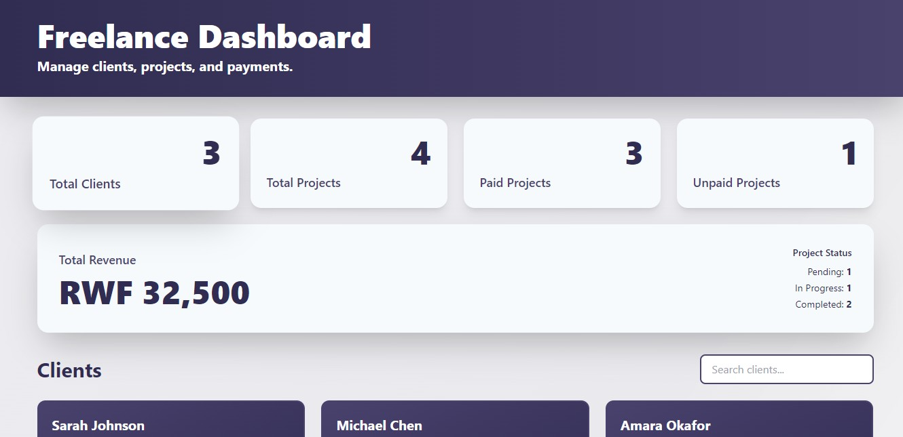

## Freelance Dashboard (React + TypeScript)
A comprehensive dashboard for managing freelance clients, projects, and payments with full TypeScript type safety.
## Technologies Used
- React 18 - UI framework
- TypeScript - Type safety and better developer experience
- Context API + useReducer - Global state management
- Tailwind CSS - Utility-first styling
- Vite - Fast build tool

## Main Features
Type Safety

 - Fully typed interfaces for Clients, Projects, and Payments
 - Discriminated union types for reducer actions
 - Type narrowing for safe data access
 - Optional property handling

State Management

- Context API with useReducer pattern
- Type-safe dispatch actions
- Centralized state management

Functionality

- View all clients with their details
- Manage projects with status tracking
- Mark projects as paid/unpaid
- Search clients and projects by name
- Filter projects by payment status
- Real-time statistics dashboard
- Conditional styling based on status

Components

- ClientCard - Displays client information with optional email handling
- ProjectList - Lists projects with payment actions
- DashboardStats - Shows aggregated statistics
- All components use typed props and handle edge cases safely

## freelance-dashboard/
- ├── src/
- │   ├── components/
- │   │   ├── ClientCard.tsx       # Client display component
- │   │   ├── ProjectList.tsx      # Project list with actions
- │   │   └── DashboardStats.tsx   # Statistics dashboard
- │   ├── context/
- │   │   └── FreelanceContext.tsx # State management
- │   ├── types.ts                 # TypeScript interfaces
- │   ├── data.ts                  # Sample data
- │   ├── utils.ts                 # Utility functions
- │   ├── App.tsx                  # Main application
- │   ├── main.tsx                 # Entry point
- │   └── index.css                # Global styles
- ├── public/
- ├── package.json
- ├── tsconfig.json
- ├── tailwind.config.js
- └── README.md

## Screenshot
